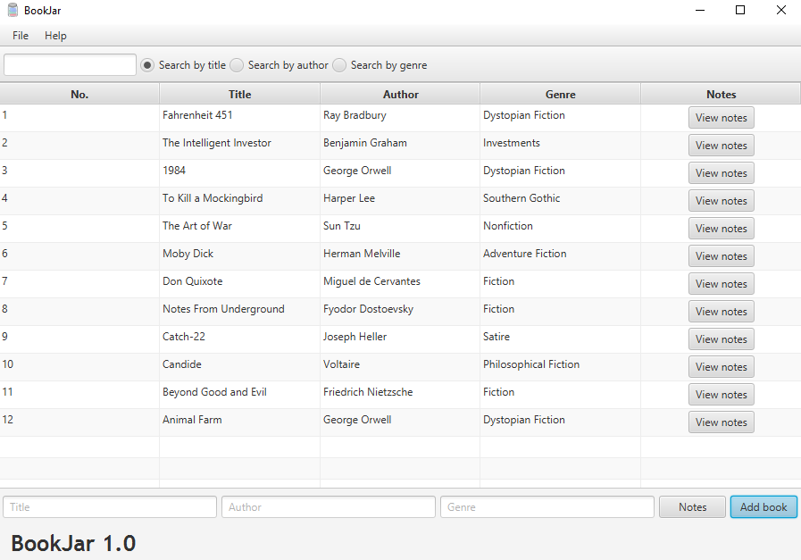
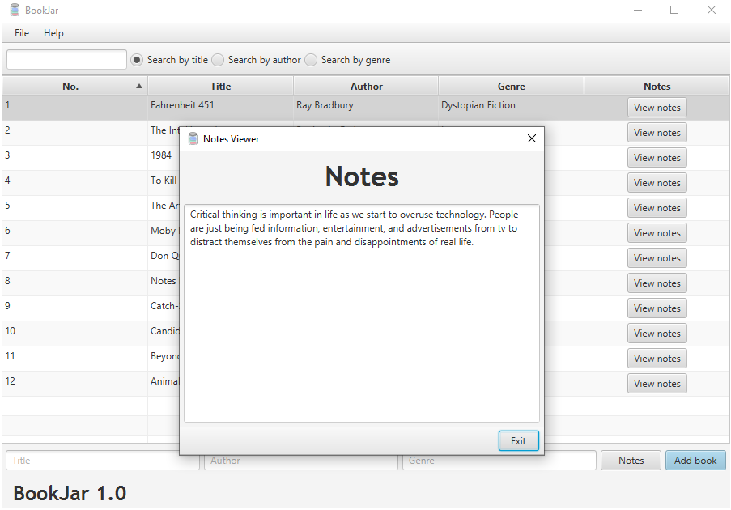
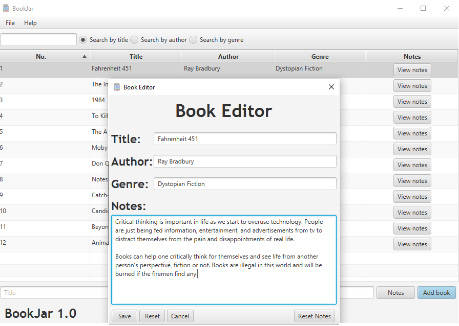
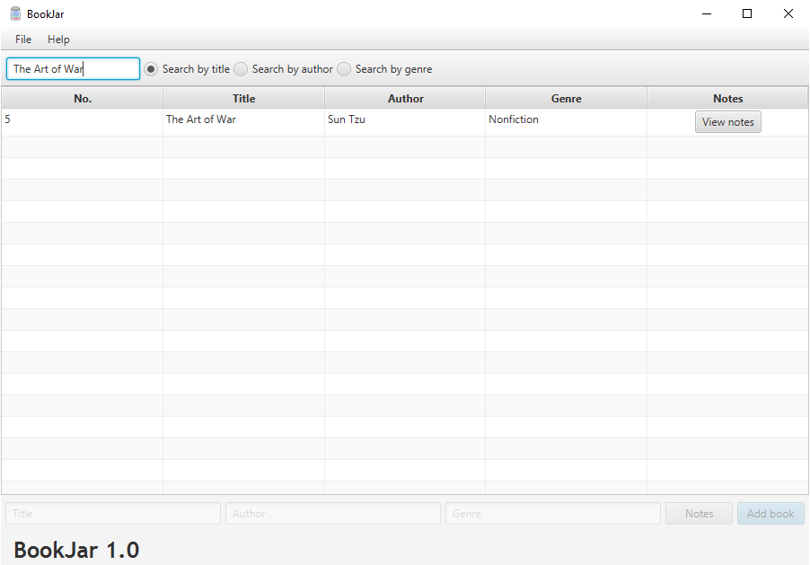
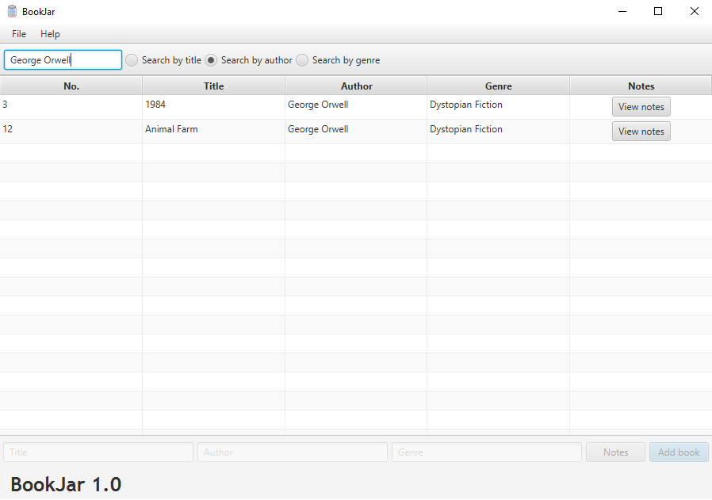
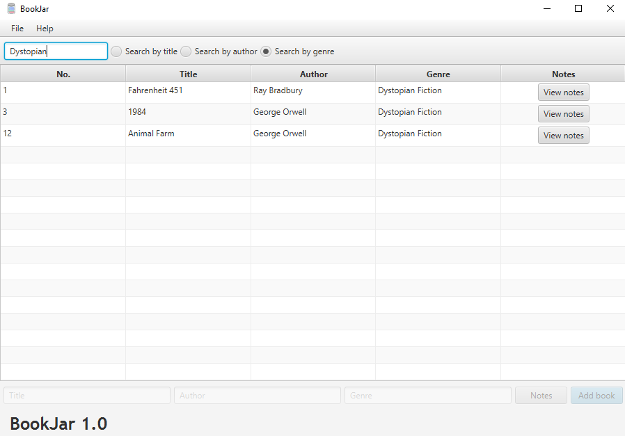
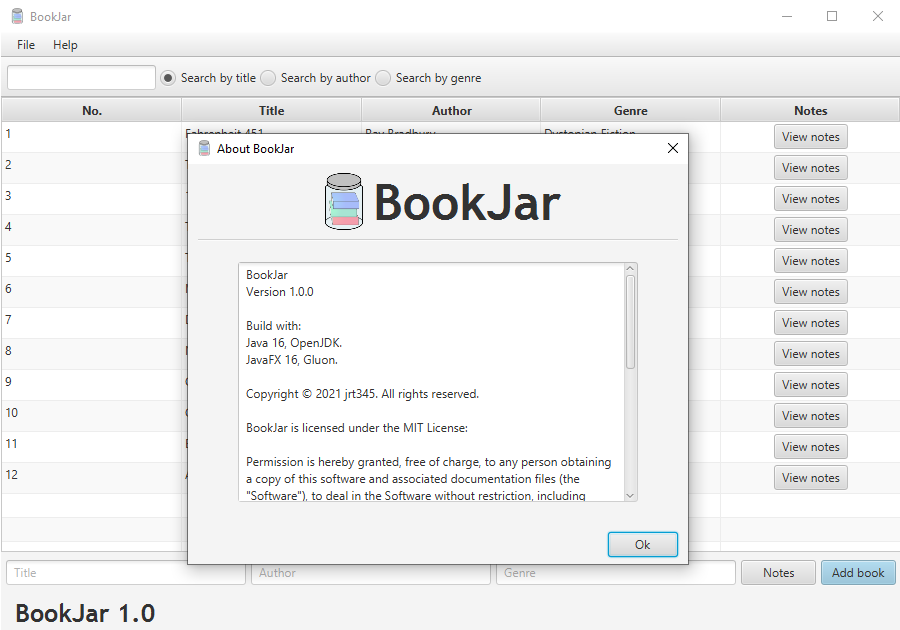

# BookJar

**A program that will help store info and notes about the books you have read.**

***

## BookJar Features:

BookJar stores the following info about a book: 

1. Title
2. Author 
3. Genre
4. Notes 

It is very easy to add a new book to the table, by just typing in the text fields,
and notes are added by pressing the "Notes" button and typing them in the text area
and saving them. Once you are content with the book you can add it to the tableview
by pressing "Add Book" button.

To view the notes of a book, press the "View Notes" to open them.

***

### Tableview context menu:

To access the context menu, right-click on the table.
*Note: The context menu options will be grayed out if there are no books in the table.*

Notes could also be viewed by right-clicking on book and pressing the "View Notes" option.

Pressing the "Edit Book" option in the right-click context menu will open a
dialog box for you to edit the selected book.

Pressing the "Delete" option in the right-click context menu, will show a dialog box 
asking for confirmation to delete the selected book.

***

### Searching for books based on: title, author, or genre:
*Note: While searching for books, you will not be able to add any books to the table.*

To search for books just type in the text field above and select what to search by.
By default, BookJar will search for books based on the title, it can be changed
by selected a different option among the three radio buttons right of the text field.

***

## Requirements to edit source code:

1. Have [Java 16.0.1](https://jdk.java.net/) to run the source code.
2. Have the [JavaFX 16 SDK](https://gluonhq.com/products/javafx/) installed.
3. Have [SceneBuilder](https://gluonhq.com/products/scene-builder/) installed to easily edit .fxml files (optional, but highly recommended).

***

## Screenshots:

#### Home screen:

#### Viewing book notes:

#### Editing a book:

#### Searching books by title:

#### Searching books by author:

#### Searching books by genre:

#### About box:

